# Localizing Visual Sounds the Hard Way
- [Localizing Visual Sounds the Hard Way](#localizing-visual-sounds-the-hard-way)
  - [About](#about)
    - [Abstract](#abstract)
  - [Importance in Context](#importance-in-context)
  - [Implementation](#implementation)
    - [Installation](#installation)
    - [Dataset](#dataset)
    - [ResNet-18](#resnet-18)
    - [Loss Function](#loss-function)
    - [Forwards Pass](#forwards-pass)
    - [Adjusted Weights](#adjusted-weights)
    - [Key Differences From Original Paper](#key-differences-from-original-paper)
  - [Results](#results)
    - [1. Image 1 prediction A vs B](#1-image-1-prediction-a-vs-b)
    - [2. Image 2 prediction A vs B](#2-image-2-prediction-a-vs-b)
    - [3. Image 3 prediction A vs B](#3-image-3-prediction-a-vs-b)
    - [4. Image 4 prediction A vs B](#4-image-4-prediction-a-vs-b)
    - [5. Image 5 prediction A vs B](#5-image-5-prediction-a-vs-b)
    - [6. Image 6 prediction A vs B](#6-image-6-prediction-a-vs-b)
  - [Conclusion](#conclusion)
  - [References](#references)


## About 
A Keras based implementation of the paper [Localizing Visual Sounds the Hard Way](https://ieeexplore.ieee.org/document/9578770) which appeared in CVPR2021. In this paper the authors take into account the uncertainty aspects in contrastive learning. The paper attempts to solve the sound localization in a self supervised way with a special loss function which takes into account the uncertain area around the object which emits sound.

The **GitHub repository** is available here: [github.com/tomfluff/sound_localization_hard_way](https://github.com/tomfluff/sound_localization_hard_way)

### Abstract
> The objective of this work is to localize sound sources that are visible in a video without using manual annotations. Our key technical contribution is to show that, by training the network to explicitly discriminate challenging image fragments, even for images that do contain the object emitting the sound, we can significantly boost the localization performance. We do so elegantly by introducing a mechanism to mine hard samples and add them to a contrastive learning formulation automatically. We show that our algorithm achieves state-of-the-art performance on the popular Flickr SoundNet dataset. Furthermore, we introduce the VGG-Sound Source (VGG-SS) benchmark, a new set of annotations for the recently-introduced VGG-Sound dataset, where the sound sources visible in each video clip are explicitly marked with bounding box annotations. This dataset is 20 times larger than analogous existing ones, contains 5K videos spanning over 200 categories, and, differently from Flickr SoundNet, is video-based. On VGG-SS, we also show that our algorithm achieves state-of-the-art performance against several baselines.

## Importance in Context
This paper has introduced two key elements: 
1. New loss for sound localization contrastive learning.
2. A new benchmark dataset VGG-SS (annotated) for the problem of sound localization.

The problem of sound localization is complicated. In a supervised setting the lack of correctly annotated data creates an issue of achieving high accuracy results. So the idea of self-supervised could prove the important in that context. Up to the publication of this paper, the contrastive nature of self-supervised learning on this problem has used the obvious approach of contrasting an image-sound pair with the other samples (when $i\neq j$).

This paper introduces a new type of thinking which is inspired by the trimap concept. A sound source in an image could be divided into three parts:
1. The firmly positive part
2. The uncertain region
3. The firmly unrelated part (background)

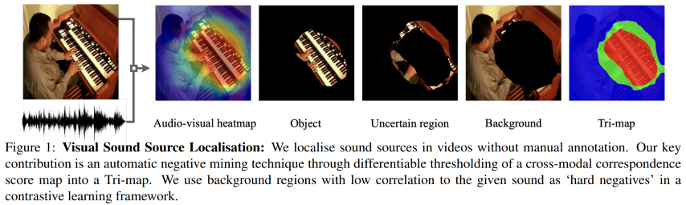

The authors of this paper choose to utilize this division and model a loss function which takes into account both the easy negative part (the background) and the hard negative part (uncertain region). The term hard is used to describe the _hard to decide_ sort of notion.

The definition of the loss as it appears in the paper is constructed in several parts:

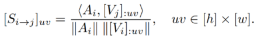

Here $S_{i\rightarrow j}$ represents the image-audio correlation matrix.

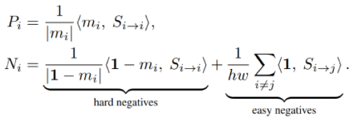

Here we see the positive and negative parts of the reinforment data where $m_i$ is the pseudo-ground-truth mask.

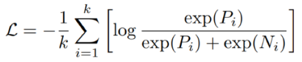

Here we can see the loss function itself, where $k$ is the number of images.

And when putting it all together we get the following complete picture:

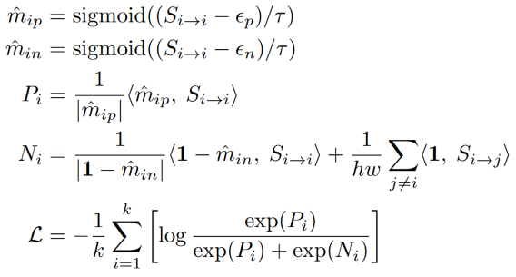

This allows the generation of the trimap as well where we have the positive region $m_{ip}$, the uncertain region $m_{in}$ and the background.

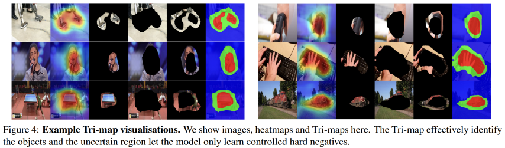

## Implementation
### Installation
Both a `conda` compatible `environment.yml` file is supplied as well as a `pip` installation `requirements.txt` file (python version is 3.9.13). Moreover it is crucial to correctly install the requiorements for Tensorflow v2 from the [official page](https://www.tensorflow.org/install), and optionally install the pytorch requirements [from here](https://pytorch.org/get-started/locally/) to run the `resnet18.py` file for ResNet-18 generation.

### Dataset
For testing and implementation purposes I worked using the unlabeled part of the introduced VGG-SS dataset. I did so using a custom script to download video sections from YouTube, extract a 3 second audio-video pair (from the middle of the VGG-SS video). As well as extracted the middle frame of the video sample to use in my implementation. All as mentioned in the paper.

The scripot `vggss_dl.py` takes care of that part. But is reliant on the existence of `"vggss.json"` file which can be downloaded from [here](https://www.robots.ox.ac.uk/~vgg/research/lvs/data/vggss.json). Also, it is requierd to have [FFMPEG](https://ffmpeg.org/) installed on your system.

All downloaded assets need to be placed accordingly in the following directory structure:
```
data
│   image_01.jpg
│   audio_01.wav
│   image_02.jpg
│   audio_02.wav
│   ...
```

### ResNet-18
In order to implement this network architecture there was aneed to implement a ResNet-18 as well as include pretrained weights (of the imagenet dataset) as a start for the vision part of the implementation. Sadly, for some unknown reason, Keras does not include an implementation of ResNet-18/36, but only ResNet-50/100.

Therefore, there was a need to generate the ResNet-18 itself. As well as import the pretrained weights. With the help of [this article](https://dmolony3.github.io/Pytorch-to-Tensorflow.html) I was able to generate an accurate ResNet as well as import and save pytorch pretrained weights on the Keras model. A detailed breakdown and full model available in `resnet18.py`.

For this network architecture it was needed to ignore the top-part of the ResNet. The pretrained weights (`imagenet.resnet18.h5`) used a top-less architecture. And the corresponding code is in `model.py`.

### Loss Function
The core of this paper was the newly defined loss function which takes advantage of the "background" of the image (frame) as well as other pictures as negatives. By taking the output of the two ResNet models (vision and audio), and computing the correlation or misscorrelation between the two the loss is calculated.

The loss calculation itself is divided into two sections, the first calculates the learning variables and the second uses these to calculate the loss itself.

```python
def __calc_reinforcement(self, frame, audio):
    # join audio and frame together (already normalized)
    S_ii = tf.expand_dims(tf.einsum('nqac,nchw->nqa', frame, tf.expand_dims(tf.expand_dims(audio,2),3)), 1)
    S_ij = tf.einsum('nqac,ckhw->nkqa', frame, tf.expand_dims(tf.expand_dims(tf.transpose(audio),2),3))
    
    # trimap generation
    m_ip = tf.sigmoid((S_ii-self.eps_pos)/self.tau)
    m_in = tf.sigmoid((S_ii-self.eps_neg)/self.tau)
    neg = 1 - m_in
    
    # Positive (Pi)
    Pi = tf.reduce_sum(tf.reshape((m_ip*S_ii), (*S_ii.shape[:2],-1)),axis=-1) / tf.reduce_sum(tf.reshape(m_ip,(*m_ip.shape[:2],-1)),axis=-1)
    # Negative (Ni) [EASY]
    n_all = tf.sigmoid((S_ij-self.eps_pos)/self.tau)
    Ni_easy = (tf.reduce_sum(tf.reshape(n_all*S_ij,(*S_ij.shape[:2],-1)),axis=-1) / tf.reduce_sum(tf.reshape(n_all,(*n_all.shape[:2],-1)),axis=-1)) * self.mask
    # Negative (Ni) [HARD]
    Ni_hard = tf.reduce_sum(tf.reshape((neg*S_ii), (*S_ii.shape[:2],-1)),axis=-1) / tf.reduce_sum(tf.reshape(neg,(*neg.shape[:2],-1)),axis=-1)

    data = tf.concat([Pi,Ni_hard,Ni_easy],axis=1)*self.temperture
    return data
```

```python
def __calc_loss(self, data):
    Pi = data[:,0:1]
    Ni = tf.reduce_sum(data[:,1:],axis=1)
    Pi_e = tf.math.exp(Pi)
    Ni_e = tf.math.exp(Ni)
    
    loss = (-1.0 / self.batch_size) * tf.reduce_sum(tf.math.log(Pi_e / (Pi_e + Ni_e)))
    return loss
```

### Forwards Pass
The architecture of the forward pass is relatively straight-forward. Input image (frame) and audio is fed into the model, each passed on a respective ResNet-18. The image passed on a ResNet-18 pretrained on `imagenet` weights, and the audio on an untrained ResNet-18. These will generate our encoding of the image and the audio inputs.

Using the information from the two ResNets we calculate the reinforcement parameters as well as the loss. This is also done in two parts because of the way Keras works. with `call()` we handle the forward pass, and with `train_step()` we handle the full flow as well as the loss calculation.

```python
def call(self, inputs, training=None, mask=None):
    frame_in, audio_in = inputs
    # frame
    frame = self.frame_norm(frame_in / 255.0)
    frame = self.frame_model(frame)
    frame = tf.math.l2_normalize(frame,axis=3)
    # audio
    audio = self.audio_model(audio_in)
    audio = self.audio_pool2d(audio)
    audio = tf.math.l2_normalize(audio,axis=1)
    
    data, heatmap, pos_heatmap = self.__calc_reinforcement(frame, audio)
    return data, heatmap, pos_heatmap, frame_in
```

```python
def train_step(self, data_in):
        frame_in, audio_in = data_in[0]
        with tf.GradientTape() as tape:
            # forward pass on data
            data, _, _, _ = self.call((frame_in, audio_in))
            # calculation of loss
            loss = self.__calc_loss(data)
        
        learnable_params = (
            self.frame_model.trainable_variables + self.audio_model.trainable_variables
        )
        gradients = tape.gradient(loss, learnable_params)
        self.optimizer.apply_gradients(zip(gradients, learnable_params))

        # monitor loss
        self.loss_tracker.update_state(loss)
        return {"loss": self.loss_tracker.result()}
```

### Adjusted Weights
During the operation of the training, we keep track of both the cision and audio ResNet-18 and adjust the weights on these based on out new loss function. This process is fine-tuning the defined ResNets to focus on the key objective which is correlate sound to an object. 

This can be seen on this part of the `train_step()` function:
```python
learnable_params = 
    (
        self.frame_model.trainable_variables + self.audio_model.trainable_variables
    )
    gradients = tape.gradient(loss, learnable_params)
    self.optimizer.apply_gradients(zip(gradients, learnable_params))
```

### Key Differences From Original Paper
In this implementation there are several differences. These include:
1. Learning rate $10^{-7}$ instead of the $10^{-4}$ (in the paper)
2. Input image size $(448,448)$ instead of $(224,224)$ (in the paper)
3. Batch size of $6$ instead of $256$ (in the paper)

For (1), it seems that because of the lack of ability to process big batches of data, as well as the lack of the quantity of data that the lower learning rate created a situation where the optimizer would move too wuickly at each step.

For (2), it seems that using the regular ResNet-18 architecture as proposed in [Deep Residual Learning for Image Recognition](https://ieeexplore.ieee.org/document/7780459) is a tad different than the one used in the paper and that the last layer is not downsampled, which generates a $(14,14,512)$ output. When in practice, the ResNet outputs a $(7,8,512)$ for inputs of $(224,224,3)$. So a small adjustment to the image dimensions was implemented.

For (3) this stems from the lack of processing power on my end. Better machines could handle better execution.

## Results
The training was generated over 2700 imahe-audio pairs in 10 parts of 270 pairs, with batch size of 6 and 4 epochs. Let us see the plot of the loss function over the training sections:

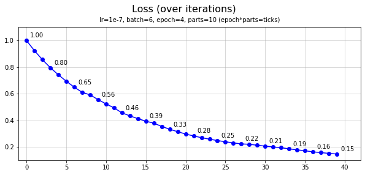

And let us also examine some results. The results are presented in two timepoints, after part 1 of the training (4 epochs) and after part 10 of the training (40 epochs). The difference in the results is very visible and the benefit of the proposed methos is clearly noticable. We will refer to part 1 as prediction A and part 10 as prediction B. 

From left to right: original image, full heatmap, strongly positive heatmap, clipped positive image.

**Note:** these test images were not part of the training data of the algorithm.

### 1. Image 1 prediction A vs B

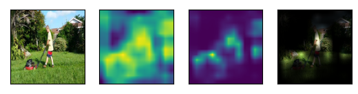

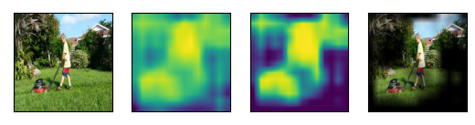

### 2. Image 2 prediction A vs B

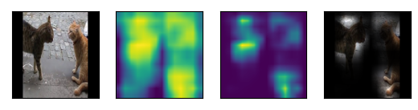

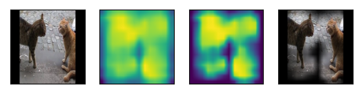

### 3. Image 3 prediction A vs B

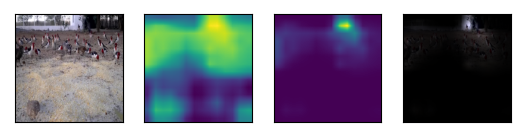

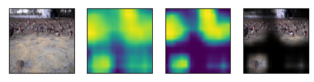

### 4. Image 4 prediction A vs B

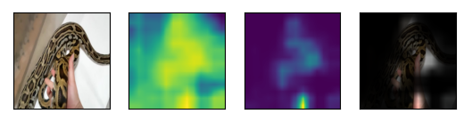

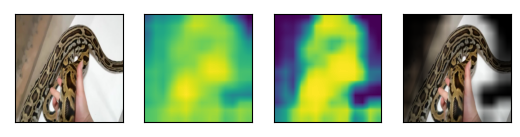

### 5. Image 5 prediction A vs B

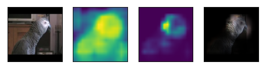

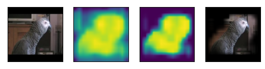

### 6. Image 6 prediction A vs B

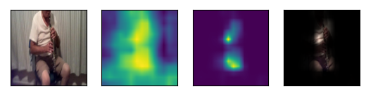

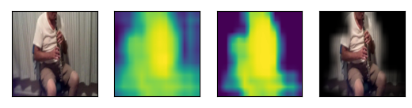

## Conclusion
The implementation I provided demonstrates the strength of the proposed method. Even with a weaker learning method os smaller dataset and batch sizes. With better larger dataset and a more capable machine, as demonstrated in the paper, I believe that the results would increase even further.

## References
```
H. Chen, W. Xie, T. Afouras, A. Nagrani, A. Vedaldi and A. Zisserman, "Localizing Visual Sounds the Hard Way," 2021 IEEE/CVF Conference on Computer Vision and Pattern Recognition (CVPR), 2021, pp. 16862-16871, doi: 10.1109/CVPR46437.2021.01659.
```

```
K. He, X. Zhang, S. Ren and J. Sun, "Deep Residual Learning for Image Recognition," 2016 IEEE Conference on Computer Vision and Pattern Recognition (CVPR), 2016, pp. 770-778, doi: 10.1109/CVPR.2016.90.
```